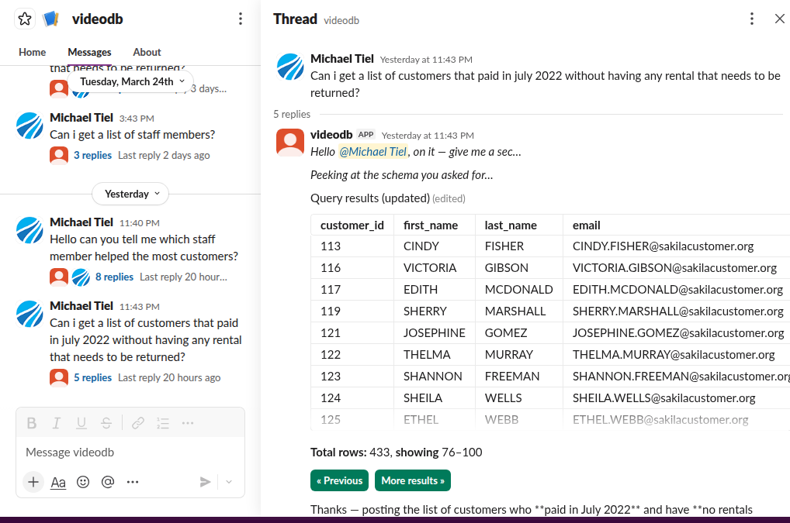
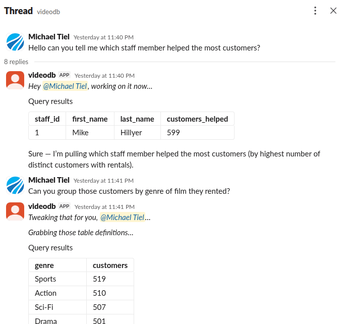
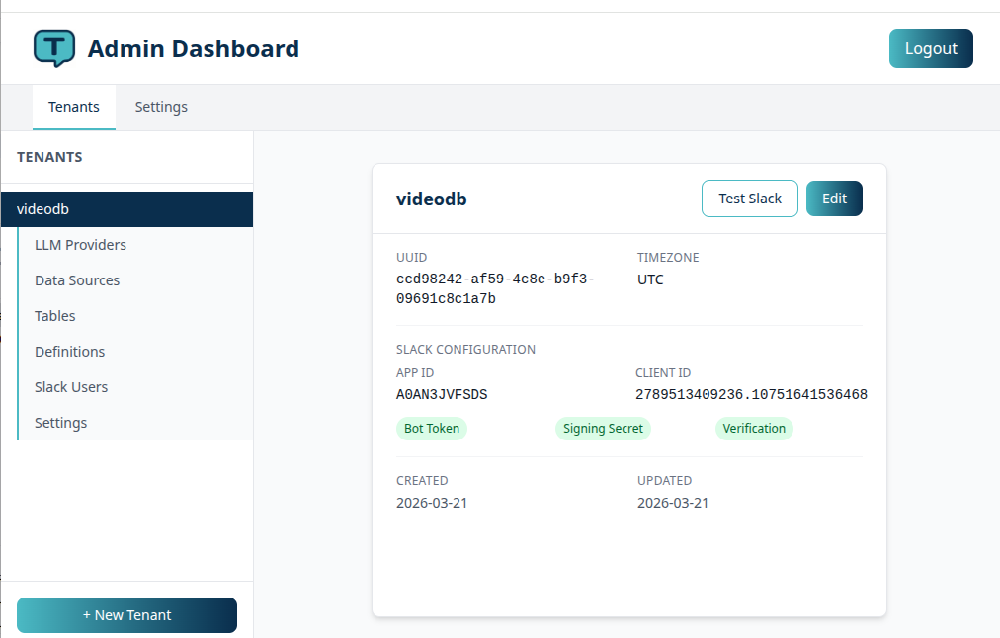
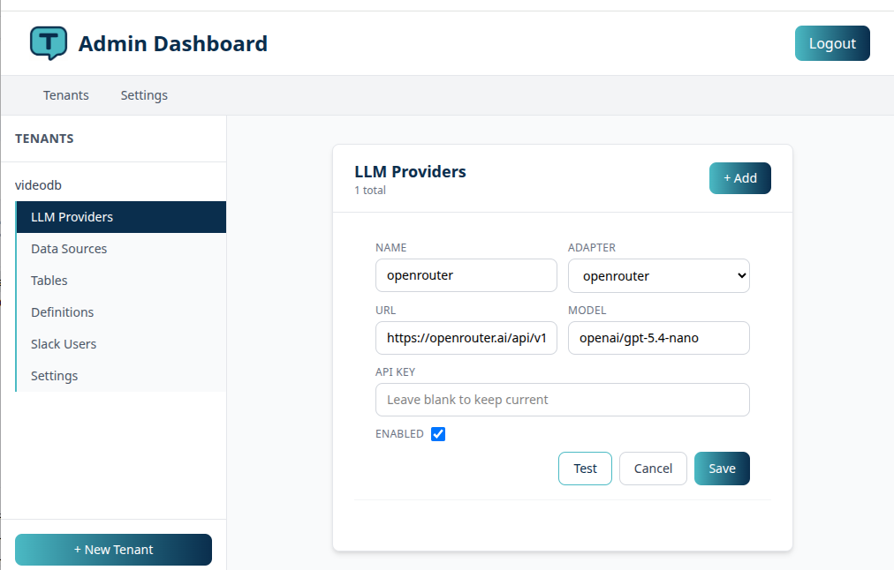

# ThreadQL

Multi-tenant natural language to SQL via Slack. Users ask questions in Slack, ThreadQL converts them to SQL queries using LLMs, executes them against configured datasources, and returns formatted results.



- **Documentation**: [threadql.com](https://threadql.com)
- **GitHub**: [github.com/emtay-com/threadql](https://github.com/emtay-com/threadql)

## Local Development

### Prerequisites

- Docker & Docker Compose
- PHP 8.4, Composer, Node.js (for running outside Docker)

### Quick Start

```bash
make up          # Start all services
make bash        # Shell into the app container
make test        # Run tests
make ecsfix      # Fix code style
```

### Dev Servers

```bash
composer dev     # Starts artisan serve, queue:listen, pail (logs), and npm dev (vite)
```



See [CLAUDE.md](CLAUDE.md) for full development documentation.

---

## Kubernetes Deployment (Helm)

### Prerequisites

1. **A Kubernetes cluster** (k3s, EKS, GKE, DOKS, etc.)
2. **Helm 3.x** installed

### 0. Point your DNS to the cluster

Get the external IP:

```bash
kubectl get svc -l app.kubernetes.io/name=kubernetes-ingress
```

Create a DNS A record pointing your domain to the `EXTERNAL-IP`.

### 1. Add the Helm repository

```bash
helm repo add emtay https://emtay-com.github.io/helm-charts
helm repo update
```

### 2. Install cert-manager (required for TLS)

cert-manager must be installed **before** deploying ThreadQL. It manages TLS certificates via Let's Encrypt.

```bash
kubectl apply -f https://github.com/cert-manager/cert-manager/releases/latest/download/cert-manager.yaml
kubectl wait --for=condition=Available deploy --all -n cert-manager --timeout=120s
```

Verify it's running:

```bash
kubectl get pods -n cert-manager
```

All three pods (`cert-manager`, `cert-manager-cainjector`, `cert-manager-webhook`) should be `Running` and `Ready`.

### 3. Create your values file

Copy the appropriate example and fill in your values:

**Cloud providers (no built-in ingress controller) — uses HAProxy:**

```bash
cp helm/threadql/haproxy.values.yaml.example helm/threadql/my-values.yaml
```

**k3s (ships with Traefik):**

```bash
cp helm/threadql/traefik.values.yaml.example helm/threadql/my-values.yaml
```

Edit `my-values.yaml` and set:

| Value | Description |
|-------|-------------|
| `mysql.rootPassword` | MySQL root password |
| `ingress.hosts[0].host` | Your domain (e.g. `threadql.example.com`) |
| `ingress.tls[0].hosts[0]` | Same domain |
| `certManager.email` | Email for Let's Encrypt notifications |
| `env.APP_KEY` | Generate with `php artisan key:generate --show` |
| `env.APP_URL` | `https://your-domain.com` |
| `env.JWT_SECRET` | Random 64-character string |
| `env.MASTER_ADMIN_PASSWORD` | Admin panel password |

### 4. Deploy

```bash
helm upgrade --install app emtay/threadql \
  -f helm/threadql/my-values.yaml
```

Or from the local chart:

```bash
helm dependency build helm/threadql
helm upgrade --install app helm/threadql \
  -f helm/threadql/values.yaml \
  -f helm/threadql/my-values.yaml
```



### Verify TLS

The TLS certificate will be issued automatically after rollout once DNS propagates (typically 1-5 minutes).

```bash
kubectl get certificate          # Should show READY=True
kubectl get clusterissuer        # Should show READY=True
curl -I https://your-domain.com  # Should return 200 with valid cert
```

### Troubleshooting TLS

If the certificate is not issued:

```bash
kubectl describe certificate threadql-tls
kubectl describe challenge -A
kubectl get order -A
kubectl logs -n cert-manager deploy/cert-manager
```

**Common issues:**

- **"ClusterIssuer not found"** — cert-manager was not installed before deploying. Install it and redeploy.
- **Challenge times out** — The solver `ingressClassName` in `certManager.solvers` must match `ingress.className`. If you use HAProxy, both must be `haproxy`. If Traefik, both must be `traefik`.
- **Webhook errors on install** — cert-manager's webhook needs a few seconds after installation. Wait and retry: `kubectl wait --for=condition=Available deploy --all -n cert-manager --timeout=120s`

### Architecture

The Helm chart deploys:

| Component | Description |
|-----------|-------------|
| **App** (nginx + php-fpm) | Laravel application |
| **Worker** | Background queue processor |
| **Redis** | Queue and cache backend |
| **MySQL** | Primary database (optional — can use external) |
| **HAProxy** | Ingress controller (optional — for clusters without one) |
| **ClusterIssuer** | Let's Encrypt certificate issuer (when `certManager.enabled`) |



### Useful Commands

```bash
# Check pod status
kubectl get pods

# View app logs
kubectl logs deploy/app-threadql -c php

# Run artisan commands
kubectl exec deploy/app-threadql -c php -- php artisan migrate

# Restart after config changes
kubectl rollout restart deploy/app-threadql
```

For full deployment documentation, see [threadql.com](https://threadql.com).

## License

This project is licensed under the MIT License. See [LICENSE](LICENSE).
